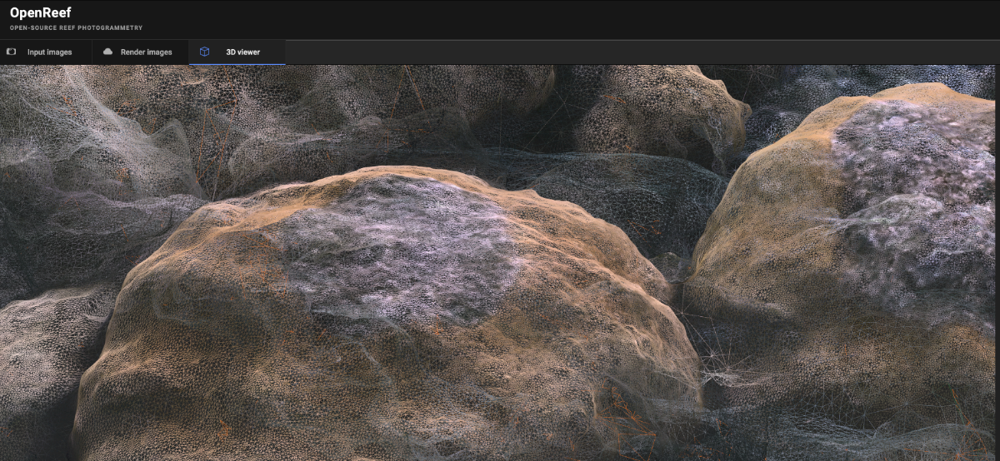
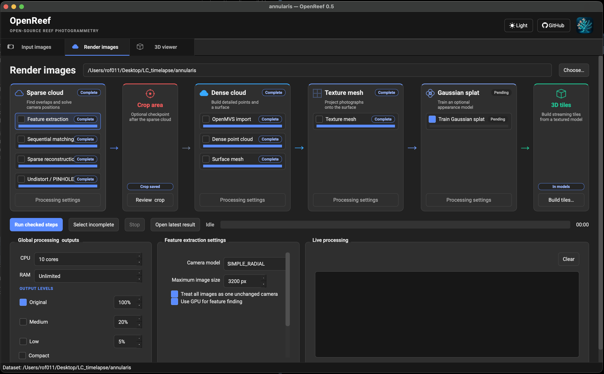
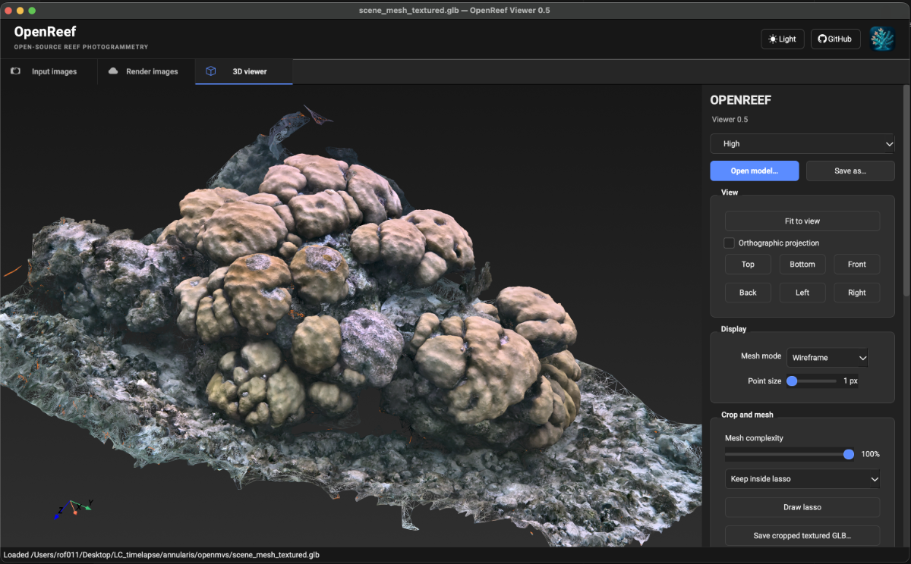
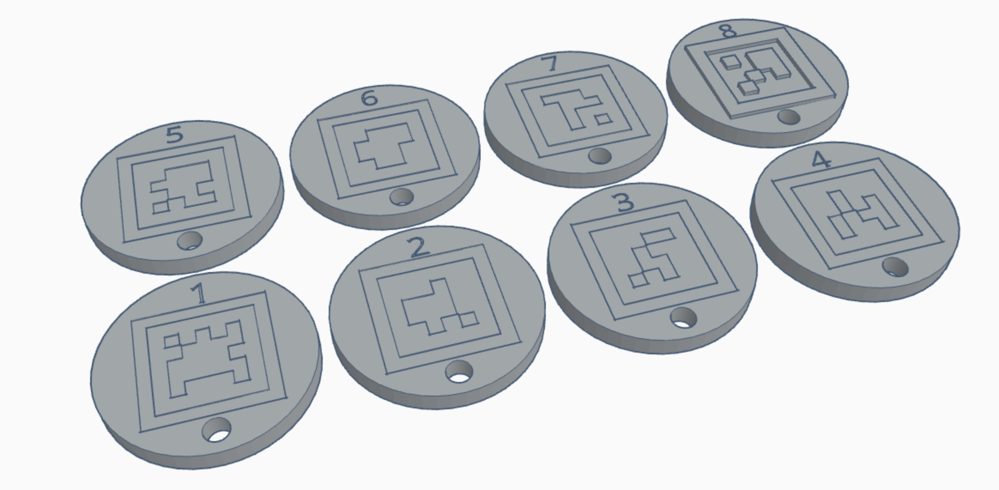

[OpenReef](https://github.com/marine-ecologist/openreef/) is an open-source desktop workspace for reconstructing 3D coral and reef-scale 3D models without requiring a US\$3,499 Metashape Pro licence. OpenReef is based around underwater photogrammetry and large-area imaging workflows in which overlapping photographs are converted into georeferenced or locally scaled 3D reconstructions that can be revisited through time.

OpenReef adopts a similar underlying standardised workflow as ReefShape: standardised acquisition, repeatable reconstruction, explicit quality control, and analysis-ready outputs, but replaces proprietary processing dependencies (e.g. Metashape) with an open-source reconstruction stack:

- [COLMAP](https://colmap.github.io/index.html) performs feature extraction and matching, camera calibration and pose estimation, and sparse structure-from-motion reconstruction

- [OpenMVS](https://github.com/cdcseacave/openmvs) converts the sparse reconstruction into dense point clouds, reconstructed and refined surface meshes, and image-derived texture maps

- [OpenSplat](https://github.com/WebODM/OpenSplat) generates 3D Gaussian-splat representations from calibrated camera poses and sparse points, providing an alternative photorealistic representation for interactive rendering and visualisation.

- [assimp](https://github.com/assimp/assimp) converts reconstructed 3D assets between formats, including web-friendly glTF/GLB outputs.

- [PyVista](https://pyvista.org)/[VTK](https://vtk.org) provide embedded 3D visualisation and analysis of sparse and dense point clouds, meshes, camera geometry, and reconstruction quality-control outputs.

|  |  |
|----|----|
| {width="600"} | {width="600"} |

OpenReef is fully functional but currently under development. v1.0 aims to include:

- automatically recognised fixed and random open-source 3D printed coded targets using [apriltag](https://april.eecs.umich.edu/software/apriltag) to give consistent scale and coordinate frame through time, allowing reconstructions to become a quantitative monitoring product rather than simply a 3D visualisation.

- quantitative measurement (e.g. colony dimensions, surface area, volume, structural complexity, and change between surveys)

- 2D orthomosaics and Digital Elevation Model (DEM) outputs

{width="600"}
